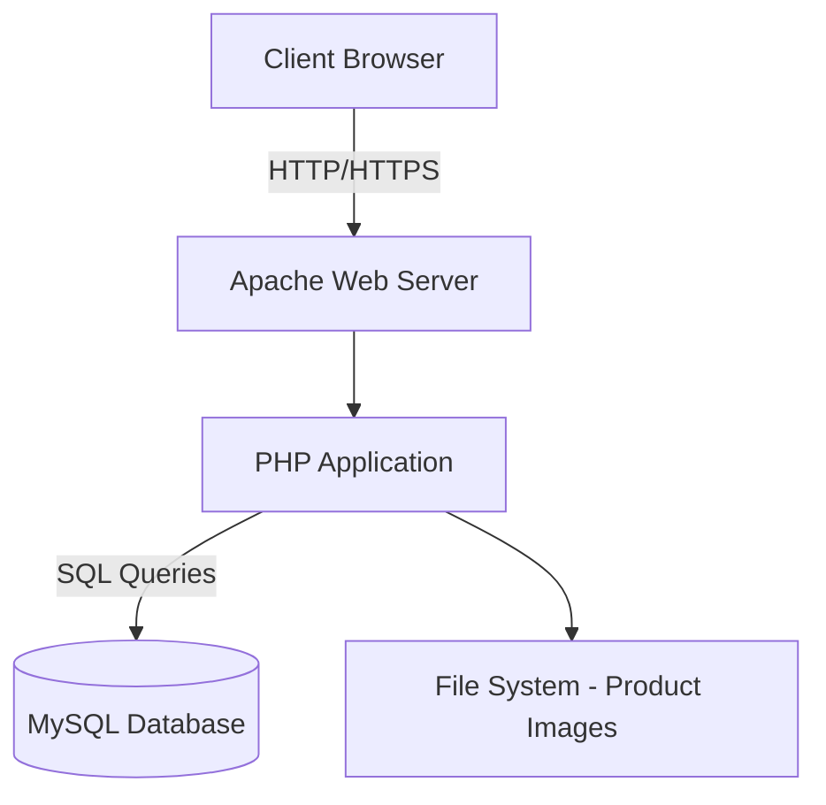

# 🛒 E-commerce MVP Project

## Introduction

Welcome to the E-commerce MVP Project, a foundational step towards creating a robust online shopping platform. This project represents the essential features of an e-commerce website, demonstrating core functionality while leaving room for future enhancements.

🌐 [Explore the MVP](#) not now
📝 [Final project blog article](https://www.mafasite.com/index.php/mvp-landing-page/)
👤 [Connect with me on LinkedIn](https://www.linkedin.com/in/youssef-mafamane-04a9b4229/)

 
## The Story Behind the MVP

### 💡 Inspiration

The idea for this E-commerce MVP sparked from a desire to understand the core components of online retail platforms. As an aspiring full-stack developer, I wanted to create a project that would challenge me to implement essential e-commerce features while keeping the scope manageable.

### 🎯 The Goal

My primary objective was to build a functional, albeit basic, e-commerce platform that could:
1. Allow users to browse products
2. Implement a simple cart system
3. Process basic orders
4. Provide a foundation for future enhancements

## 🛠 Technical Overview

### Architecture

This MVP is built on a WAMP stack (Windows, Apache, MySQL, PHP), with some JavaScript for enhanced interactivity.



### Key Features and Implementation

1. **Product Listing**: 
   Implemented a simple grid layout for products using CSS Flexbox:

   ```css
   .product-grid {
     display: flex;
     flex-wrap: wrap;
     gap: 20px;
   }

   .product-card {
     flex: 0 1 calc(33.333% - 20px);
     /* other styles */
   }
   ```

2. **Basic Cart Functionality**:
   Used PHP sessions to maintain cart state:

   ```php
   function addToCart($productId, $quantity) {
       if (!isset($_SESSION['cart'])) {
           $_SESSION['cart'] = array();
       }
       
       if (isset($_SESSION['cart'][$productId])) {
           $_SESSION['cart'][$productId] += $quantity;
       } else {
           $_SESSION['cart'][$productId] = $quantity;
       }
   }
   ```

3. **Simple Order Processing**:
   Created a basic order table in the database:

   ```sql
   CREATE TABLE orders (
       order_id INT PRIMARY KEY AUTO_INCREMENT,
       user_id INT,
       order_date TIMESTAMP DEFAULT CURRENT_TIMESTAMP,
       total_amount DECIMAL(10, 2) NOT NULL,
       status ENUM('pending', 'processing', 'completed') DEFAULT 'pending',
       FOREIGN KEY (user_id) REFERENCES users(user_id)
   );
   ```

4. **User Authentication**:
   Implemented a straightforward registration and login system using PHP's password hashing:

   ```php
   function registerUser($username, $password, $email) {
       $hashedPassword = password_hash($password, PASSWORD_DEFAULT);
       // Insert user into database
   }

   function loginUser($username, $password) {
       // Fetch user from database
       if (password_verify($password, $user['password_hash'])) {
           // Login successful
       }
   }
   ```

## 📈 Learning and Growth

### Challenges Faced

1. **Database Design**: Deciding on the right level of complexity for the MVP was challenging. I had to resist the urge to over-engineer the database schema.

2. **Session Management**: Implementing a cart system using sessions was new to me. I learned a lot about PHP's session handling and its limitations.

3. **Security Considerations**: Even for an MVP, I wanted to ensure basic security practices were in place. This led me to research and implement proper password hashing and basic input sanitization.

### What I Learned

- The importance of clearly defining the scope for an MVP.
- Basic e-commerce workflows and how they translate to code.
- The value of simple, functional design in early-stage projects.
- The critical nature of data management in e-commerce applications.

## 🚀 Future Enhancements

While this MVP serves its purpose as a basic e-commerce platform, there's significant room for improvement:

1. **Implement a more robust product categorization system**
2. **Enhance the user interface with modern JavaScript frameworks**
3. **Integrate a real payment gateway**
4. **Add user reviews and ratings for products**
5. **Implement an admin panel for easy product management**


## 📚 Related Projects

- [E-commerce Data Analysis](#) - A data analysis project using sample data from this MVP (coming soon!)
- [E-commerce API](#) - A RESTful API based on this MVP's structure (planned)


## 🙏 Acknowledgments

- Thanks to ALX for their guidance.
- Special thanks to my peer group for their feedback and encouragement.

---

Built with ❤️ and lots of ☕ by [Youssef Mafamane]

